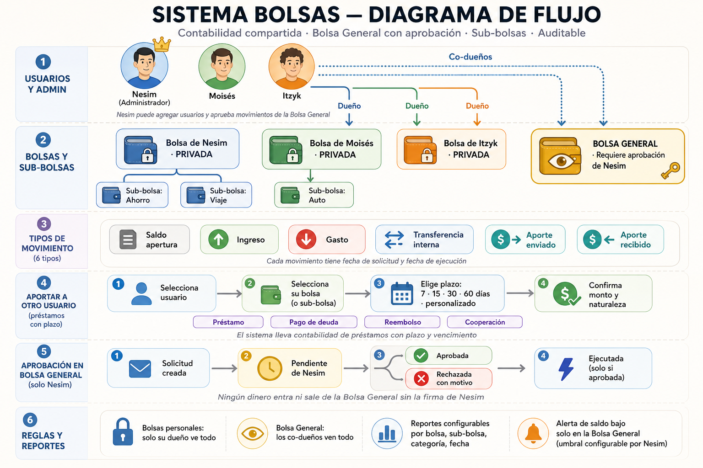

# Resumen del proyecto — Bolsas (v5)

> La versión completa está en [`Bolsas-Resumen.pdf`](./Bolsas-Resumen.pdf).

## Modelo

**Bolsas** es una app web para administrar finanzas compartidas entre
miembros de un grupo. Cada persona maneja sus propias bolsas privadas y
todos comparten una Bolsa General, con doble control por aprobación y
la posibilidad de bolsas asignadas por el administrador.

## Los tres tipos de bolsa

| Tipo | Quién controla | Movimientos |
|---|---|---|
| **Propia** | El usuario que la creó | Libres (él es la autoridad) |
| **Asignada por Nesim** | Nesim la crea y asigna | El usuario asignado solo puede **solicitar** ingresos/gastos; cada solicitud pasa por Nesim |
| **General** | Nesim + co-propietarios que él indique | Todo movimiento pasa por Nesim |

## Reglas nucleares

- **Privacidad primero**: cada dueño solo ve su bolsa y sub-bolsas.
- **Nadie mueve dinero sin permiso**: General → Nesim; propia → dueño
  (aportes entrantes); asignada → Nesim (todo lo que propone el asignado).
- **Aportar sí, retirar de bolsa ajena no**.
- **Nada se elimina**: movimientos se anulan, bolsas se archivan con
  saldo 0. Categorías sí se eliminan (movimientos quedan como
  *Sin categoría*).
- **Saldos calculados** desde movimientos activos.
- **Sub-bolsas = compartimentos** del padre.

## Otros elementos

- **Sin catálogo de categorías por defecto.** Cada usuario crea las
  suyas o describe con texto libre.
- **Aportes = préstamos por defecto** con plazo 7 / 15 / 30 / 60 días
  o personalizado.
- **Pago de deuda y reembolso** amarrados a un préstamo específico;
  éste se cierra al saldarse.
- **Recordatorios de préstamo**: 7 días, 3 días antes, día del
  vencimiento y semanal después.
- **Pestaña Préstamos** por usuario con "Me deben", "Yo debo" y
  "Cerrados".
- **Alerta de saldo bajo** solo en Bolsa General; umbral configurable
  solo por Nesim, aviso a todos los co-propietarios.
- **Reportes configurables** con **plantillas privadas** por usuario.

## Preguntas por resolver (6 en el PDF, con recomendación)

1. Aporte pendiente: ¿saldo del remitente se descuenta al instante o
   queda reservado?
2. Aporte pendiente: ¿el remitente puede cancelarlo antes de que el
   receptor decida?
3. Rechazo de aporte: ¿motivo escrito obligatorio?
4. Nesim admin: ¿puede desactivar usuarios y transferir el rol?
5. Bolsas privadas de Nesim: ¿mantienen privacidad como las demás?
6. Anular un movimiento ya aprobado en la Bolsa General: ¿requiere
   nueva aprobación de Nesim?
